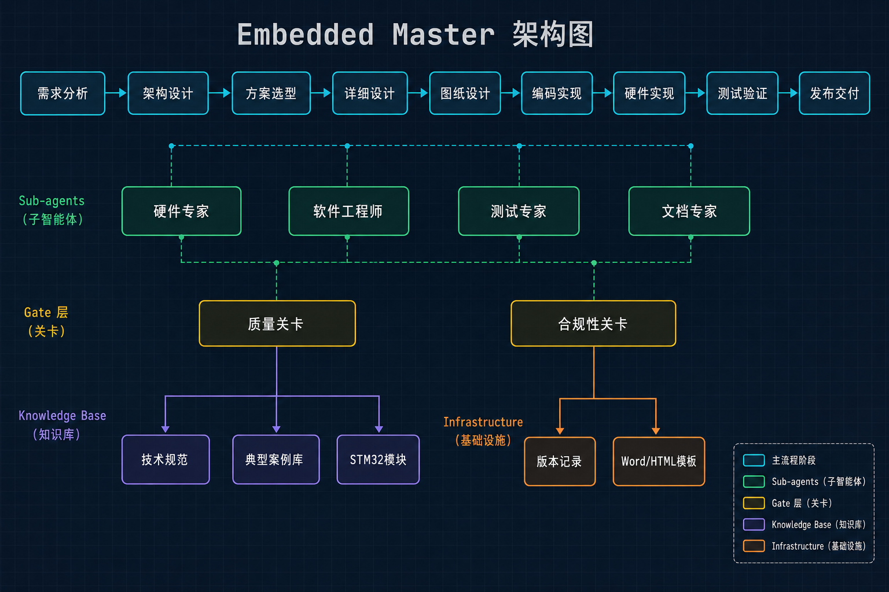
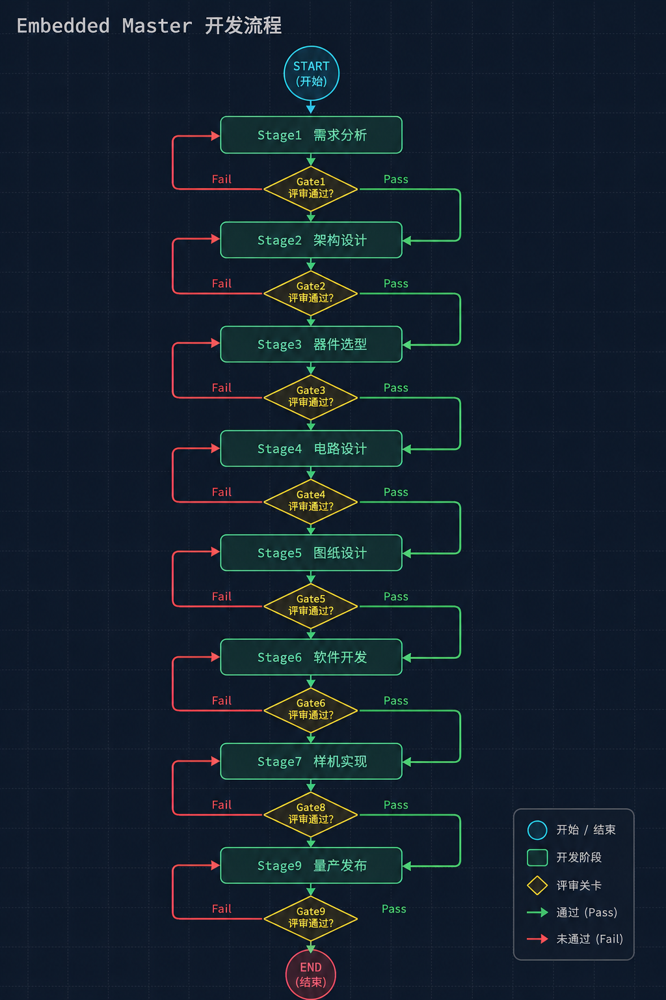

# Embedded Master

嵌入式项目全流程开发 Skill — 从需求分析到最终报告，覆盖完整开发周期。

## 架构概览



## 功能概述

Embedded Master 通过 9 个阶段 + 6 道门控实现嵌入式项目全流程自动化：

```
需求分析 → 架构设计 → 详细设计 → 约束输出 → 图表输出 → 软件设计 → 编码实现 → 测试验证 → 报告生成
```



支持两种工作模式：
- **新建模式** — 完整的 9 阶段流水线，每个阶段设有门控检查
- **迭代模式** — 针对现有项目的 Bug 修复、功能添加、硬件更换、性能优化

## 快速开始

用自然语言描述你的项目需求即可，无需记忆任何命令：

```
我要做一个基于STM32的温度报警器
```

```
用ESP32做一个物联网气象站
```

系统会自动识别意图并进入对应的工作流程。

### 工作模式

| 模式 | 适用场景 | 行为 |
|------|----------|------|
| 专业模式 | 量产项目、正式交付 | 逐项确认，每次只问 1 个问题，不做假设 |
| 快速模式 | 原型验证、技术预研 | 批量确认，使用合理默认值快速推进 |

### 迭代类型

| 类型 | 示例 |
|------|------|
| Bug 修复 | "温度传感器读数不对" |
| 功能添加 | "加一个蓝牙模块" |
| 硬件更换 | "把DHT11换成DS18B20" |
| 性能优化 | "优化一下ADC采样精度" |

## 核心特性

- **6 道门控质量检查** — 强制要求通过设计评审才能进入下一阶段
- **12 条反模式检测** — 禁止凭记忆给参数、禁止跳过评审等不良行为
- **国产生态知识库** — 内置国产芯片/电源/传感器替代方案
- **供应链风险评估** — 联网验证器件生命周期、库存、交期
- **Datasheet 驱动设计** — 所有参数必须来自数据手册，禁止凭记忆
- **经验累积机制** — 下载源、调试经验、采购记录跨会话持久化
- **专业 Sub-Agent** — 硬件评审、固件工程师、代码审查、技术文档专家
- **多格式输出** — Mermaid 图表、Word 报告、交互式 HTML 仪表盘

## 输出结构

每个项目都会在 `docs/embedded/` 目录下生成完整的结构化文档：

```
docs/embedded/
├── 01-requirements.md          # 工程约束表
├── 02-architecture.md          # 架构方案对比
├── 03-components.md            # 器件选型（含供应链验证）
├── 04-constraints.md           # 接口矩阵、电源树、PCB 约束
├── 05-wiring.md                # 引脚连接表
├── 05-flowchart.md             # 软件流程图
├── 05-block-diagram.md         # 系统框图
├── 05-bom.md                   # 物料清单
├── 06-software-architecture.md # 软件分层架构
├── 07-module-spec.md           # 模块规格定义
├── 08-detailed-design.md       # 算法与状态机设计
├── 09-review-report.md         # 设计评审报告
├── 10-coding-standard.md       # 编码规范
├── 11-test-report.md           # 测试报告
├── requirements.json           # 结构化需求数据
├── project_status.json         # 进度状态跟踪
├── experience-log.md           # 经验累积记录
├── datasheets/                 # 下载的 Datasheet 文件
├── footprints/                 # 元器件封装文件
├── 项目报告.docx               # Word 格式报告
└── report.html                 # 交互式 HTML 仪表盘
```

## 代码模板

预置的 STM32 外设驱动模板：

| 模板文件 | 对应外设 |
|----------|----------|
| `device_gpio.c.tmpl` | GPIO |
| `device_uart.c.tmpl` | UART |
| `device_spi.c.tmpl` | SPI |
| `device_iic.c.tmpl` | I2C |
| `device_adc.c.tmpl` | ADC |
| `device_tim.c.tmpl` | 定时器 |
| `device_can.c.tmpl` | CAN |

## 参考文档

| 文件 | 用途 |
|------|------|
| `references/domestic-sources.md` | 国产生态芯片地图 |
| `references/sourcing-and-risk.md` | 供应链风险评估指南 |
| `references/download-sources.md` | Datasheet/封装下载经验 |
| `references/review-checklists.md` | 硬件设计评审清单 |
| `references/verification-gates.md` | 门控验证定义 |
| `references/output-template.md` | 输出标准模板 |
| `references/design-workflow.md` | 设计工作流定义 |

## API 接口

```javascript
const em = require('C:/Users/ROG/.claude/skills/embedded-master/index.js');

// 项目管理
em.initProject(projectPath, '项目名称', 'professional');
em.getProgress(projectPath);
em.advanceToNextStage(projectPath);

// 门控检查
em.checkGate(projectPath, 1);        // 1-6
em.passGate(projectPath, 'requirements');

// 知识库
em.getDomesticSources();
em.getSourcingAndRisk();
em.getDownloadSources();

// 反模式检测
em.checkAntiPattern('这个芯片我很熟不用查手册');

// 经验记录
em.addExperience(projectPath, 'datasheet', { ... });
em.queryExperience(projectPath, 'datasheet', 'STM32F103');
```

## Sub-Agent 专家

| Agent | 触发阶段 | 职责 |
|-------|----------|------|
| `hardware-reviewer` | Gate 2-5 | 5 维度硬件评审 |
| `embedded-firmware-engineer` | 阶段 7 | 固件代码生成 |
| `code-reviewer` | 阶段 6, Gate 7 | 代码与设计审查 |
| `technical-writer` | 阶段 9 | Word 文档生成 |

## 扩展指南

### 添加门控检查项

编辑 `scripts/gate-checker.js` 添加新的验证项。

### 添加反模式规则

编辑 `scripts/anti-pattern.js` 添加新的禁止行为或合理化借口检测规则。

### 添加知识库内容

在 `references/` 目录下添加 `.md` 文件，API 会自动发现并加载。

### 添加代码模板

在 `templates/` 目录下添加 `.tmpl` 文件，使用 `em.listTemplates()` 查看模板列表。

### 项目结构

```
embedded-master/
├── skill.md                 # 主工作流定义（9阶段 + 6门控）
├── index.js                 # API 入口
├── scripts/
│   ├── gate-checker.js      # 门控验证逻辑
│   ├── anti-pattern.js      # 反模式检测
│   ├── experience-logger.js # 经验累积
│   ├── status-manager.js    # 进度状态管理
│   ├── build_flash.ps1      # STM32 编译烧录
│   ├── check_gpio_safety.ps1
│   └── start_debug.ps1
├── references/              # 知识库文档
├── agents/                  # Sub-Agent 人格定义
├── templates/               # STM32 驱动模板
└── word-docx/               # Word 文档生成规范
```

## License

内部工具 — 不作为包发布。