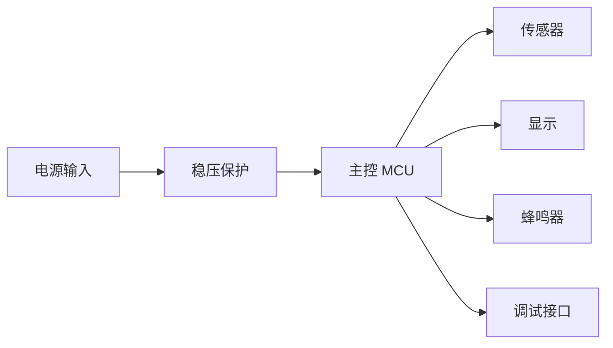
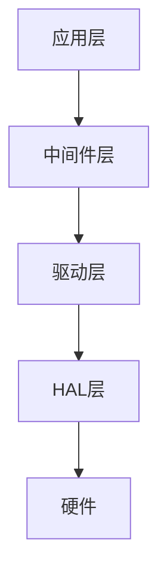

# 整合输出模板

在所有阶段完成后，将各阶段产出整合为一个完整的 `embedded-solution.md` 文件，放在 `{projectPath}/docs/embedded/` 目录下。

## 输出结构

```markdown
# [项目名称] — 嵌入式方案报告

> 生成日期：YYYY-MM-DD
> 工作模式：快速/专业
> 当前状态：已完成 9/9 阶段

---

## 1. 方案摘要

- **产品目标**：一句话描述
- **推荐架构**：MCU + 关键模块
- **推荐理由**：为什么选这个方案
- **主要风险**：Top 3 风险
- **下一步动作**：用户需要做什么

---

## 2. 需求与假设

| 项目 | 内容 | 状态 |
|------|------|------|
| 使用场景 | | 已知/假设/待确认 |
| 供电 | | 已知/假设/待确认 |
| 通信 | | 已知/假设/待确认 |
| 环境 | | 已知/假设/待确认 |
| 成本 | | 已知/假设/待确认 |
| 认证 | | 已知/假设/待确认 |
| 供应链偏好 | | 已知/假设/待确认 |

---

## 3. 用户决策选项

| 选项 | 核心取向 | 适用条件 | 代价/风险 |
|------|----------|----------|-----------|
| A | 低功耗优先 | | |
| B | 低成本优先 | | |
| C | 快速落地优先 | | |
| D | 国产供应链优先 | | |

**用户选择**：[选项 X]

---

## 4. 架构方案对比

| 方案 | 供应链取向 | MCU | 电源 | 通信 | 传感器 | 优点 | 缺点 | 结论 |
|------|-----------|-----|------|------|--------|------|------|------|
| A | 国产优先 | | | | | | | |
| B | 海外主流 | | | | | | | |
| C | 混合折中 | | | | | | | |

**用户确认**：方案 [X]

---

## 5. 系统框图



---

## 6. 关键器件建议

| 模块 | 推荐器件 | 国内候选 | 海外候选 | 关键参数 | 替代方案 | 采购链接 | Datasheet | 封装 | 主要风险 |
|------|----------|----------|----------|----------|----------|----------|-----------|------|----------|
| 主控 | | | | | | | | | |
| 电源 | | | | | | | | | |
| 通信 | | | | | | | | | |
| 传感器 | | | | | | | | | |
| 显示 | | | | | | | | | |

### 采购验证记录

| 器件 | 渠道 | 价格 | 库存 | 交期 | 验证日期 | 验证方式 |
|------|------|------|------|------|----------|----------|
| | | | | | | browser-harness |

---

## 7. 接口与信号规划

| 接口 | 信号 | 方向 | 电平 | 速率/电流 | 保护/约束 |
|------|------|------|------|-----------|-----------|
| | | | | | |

---

## 8. 电源树与功耗预算

| 电源轨 | 来源 | 负载 | 估算电流 | 控制方式 | 备注 |
|--------|------|------|----------|----------|------|
| | | | | | |

---

## 9. PCB 与结构约束

- **层数建议**：
- **分区建议**：
- **高速/射频/模拟约束**：
- **散热约束**：
- **连接器和安装约束**：
- **测试点和工装约束**：

---

## 10. 软件架构



| 层级 | 职责 | 文件 |
|------|------|------|
| 应用层 | | |
| 中间件层 | | |
| 驱动层 | | |
| HAL层 | | |

---

## 11. 模块设计

| 模块 | 职责 | 输入 | 输出 | 依赖 |
|------|------|------|------|------|
| | | | | |

---

## 12. 风险清单

| 风险 | 影响 | 概率 | 验证动作 | 截止点 |
|------|------|------|----------|--------|
| | 成本/周期/可靠性/认证 | 高/中/低 | | EVT/DVT/PVT |

---

## 13. 验证计划

| 阶段 | 测试项 | 方法 | 通过标准 |
|------|--------|------|----------|
| EVT | | | |
| DVT | | | |
| PVT | | | |

---

## 14. 模块原理图

### 14.1 电源模块

- 输入保护与电源路径：
- DCDC/LDO 拓扑与器件：
- 电源轨电压/电流预算：
- 关键元件值与引脚连接：

### 14.2 主控最小系统

- MCU 型号与封装：
- 晶振/时钟配置：
- 复位与启动电路：
- 去耦与电源引脚连接：

### 14.3 通信接口

- 接口类型与收发器：
- 电平转换与保护：
- 端接与阻抗匹配：
- 连接器引脚定义：

### 14.4 传感/执行前端

- 传感器/执行器型号：
- 模拟前端与信号调理：
- 保护与隔离：
- 关键参数值与引脚连接：

---

## 15. BOM 表

| 序号 | 器件型号 | 数量 | 单价 | 供应商 | 采购链接 | Datasheet | 备注 |
|------|----------|------|------|--------|----------|-----------|------|
| | | | | | | | |

---

## 16. 测试报告

| 测试项 | 测试方法 | 预期结果 | 实际结果 | 结论 |
|--------|----------|----------|----------|------|
| | | | | |

---

## 附录

### A. 文件清单

| 文件 | 路径 | 说明 |
|------|------|------|
| 需求文档 | docs/embedded/01-requirements.md | |
| 架构设计 | docs/embedded/02-architecture.md | |
| 器件选型 | docs/embedded/03-components.md | |
| 约束输出 | docs/embedded/04-constraints.md | |
| 图表输出 | docs/embedded/05-*.md | |
| 软件设计 | docs/embedded/06-*.md | |
| 编码报告 | docs/embedded/build-report.md | |
| 测试报告 | docs/embedded/11-test-report.md | |
| Datasheet | docs/embedded/datasheets/*.pdf | |
| 封装文件 | docs/embedded/footprints/* | |

### B. 经验记录

从 `docs/embedded/experience-log.md` 提取：
- 下载经验
- 调试经验
- 已知问题
```

## 使用方法

在 Stage 9 报告生成时，执行以下步骤：

1. 读取各阶段输出文件（01-requirements.md 到 11-test-report.md）
2. 按上述模板结构整合内容
3. 生成 `{projectPath}/docs/embedded/embedded-solution.md`
4. 同时生成 Word 报告（参考 word-docx/word-docx.md）
