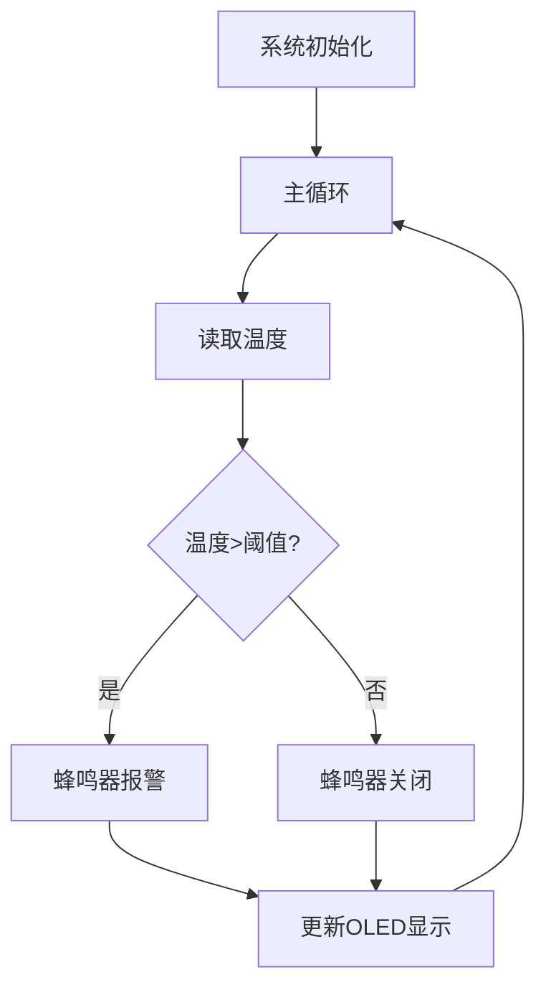
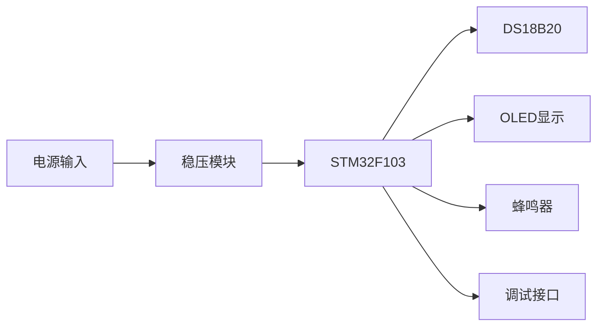
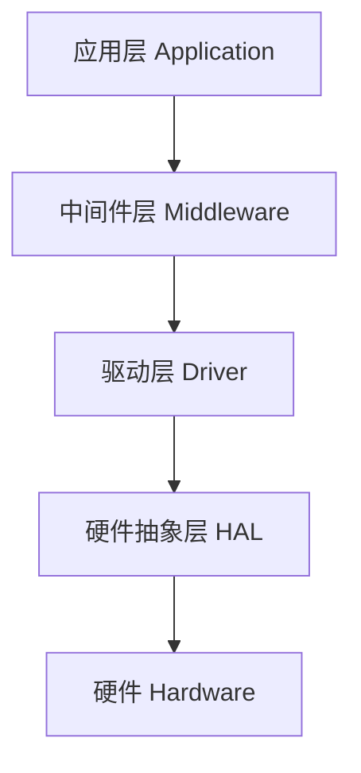

# Embedded Master — 嵌入式项目全流程开发

当用户描述嵌入式项目需求时，**本 skill 是唯一的入口**。根据用户意图自动选择**新建模式**或**迭代模式**。

## 工具依赖

| 工具 | 用途 | 安装位置 |
|------|------|----------|
| embedded-master API | 项目管理、Gate检查、知识库 | `C:/Users/ROG/.claude/skills/embedded-master/index.js` |
| browser-harness | 器件选型联网验证（价格/库存/datasheet/封装） | `C:/Users/ROG/Developer/browser-harness` |
| stm32-master | 编译烧录调试 | 内嵌 scripts/ |

## API 使用说明

本skill提供以下JavaScript API，可通过 `require('C:/Users/ROG/.claude/skills/embedded-master/index.js')` 调用：

```javascript
const embeddedMaster = require('C:/Users/ROG/.claude/skills/embedded-master/index.js');

// 初始化项目
const status = embeddedMaster.initProject(projectPath, '项目名称', 'professional');

// 检查是否为迭代模式
const isIteration = embeddedMaster.isIterationMode(projectPath);

// 获取进度显示
const progress = embeddedMaster.getProgress(projectPath);

// 执行Gate检查
const gateResult = embeddedMaster.checkGate(projectPath, 1);
console.log(gateResult.toDisplay());

// 标记Gate通过
embeddedMaster.passGate(projectPath, 'requirements');

// 进入下一阶段
const nextStage = embeddedMaster.advanceToNextStage(projectPath);

// 检测反模式
const warning = embeddedMaster.checkAntiPattern('这个芯片我很熟不用查手册');
if (warning) console.log(warning);

// 添加经验记录
embeddedMaster.addExperience(projectPath, 'datasheet', {
  器件型号: 'STM32F103C8T6',
  source: 'AllDatasheet',
  url: 'https://...'
});

// 查询经验
const experience = embeddedMaster.queryExperience(projectPath, 'datasheet', 'STM32F103');

// 检测迭代类型
const iterationType = embeddedMaster.detectIterationType('温度传感器读数不对');
// 返回: 'bug_fix'

// 检测新建模式关键词
const isNew = embeddedMaster.detectNewProjectKeywords('我要做一个温度报警器');
// 返回: true

// 检测路径
const path = embeddedMaster.detectPath('在 F:\projects\my-project 下做');
// 返回: 'F:\projects\my-project'

// 需求管理
const template = embeddedMaster.generateRequirementsTemplate('温度报警器');
embeddedMaster.saveRequirements(projectPath, template);
const requirements = embeddedMaster.loadRequirements(projectPath);
embeddedMaster.backupRequirements(projectPath);
```

---

## Sub-Agent 集成

本 skill 利用 Claude Code 原生 sub-agents 机制，在关键阶段自动调用专业 Agent：

| Sub-Agent | 文件位置 | 触发时机 | 职责 |
|-----------|----------|----------|------|
| `hardware-reviewer` | `~/.claude/agents/hardware-reviewer.md` | Stage 2-5 Gate 检查 | 硬件设计评审（5维度） |
| `embedded-firmware-engineer` | `~/.claude/agents/embedded-firmware-engineer.md` | Stage 7 编码 | 固件代码生成 |
| `code-reviewer` | `~/.claude/agents/code-reviewer.md` | Stage 6 设计评审、Stage 7 Gate 7 | 代码/设计审查 |
| `technical-writer` | `~/.claude/agents/technical-writer.md` | Stage 9 报告生成 | Word 文档生成 |

### 调用方式

在对应阶段，使用 Agent tool 调用 sub-agent：

```
Agent({
  subagent_type: "hardware-reviewer",
  prompt: "评审以下硬件设计文档，按5维度输出评审报告：...",
  description: "Hardware design review"
})
```

### Sub-Agent 与 Skills 的关系

- Sub-agents 通过 `skills: [embedded-master]` 预加载本 skill 的知识库
- Sub-agents 自动访问 `references/` 下的国产生态、供应链、下载源等文档
- Sub-agents 的 memory 设置为 `project`，可在项目内积累评审经验

### 何时不使用 Sub-agents

- 简单的技术问题直接回答，不调用 sub-agent
- 迭代模式的 bug_fix 通常不需要 sub-agent
- 用户明确要求跳过评审时

---

## 第一部分：入口与模式判断

### 1.1 确定工作目录

**默认使用当前工作目录**，无需询问用户。

**只有以下情况才切换目录：**
- 用户消息中**明确包含路径**（如"在 F:\projects\my-project 下做"）
- 用户明确说"换个目录"或"在XX目录下"

将确定的路径记为 `projectPath`，后续所有操作都基于此路径。

### 1.2 模式判断

确定工作目录后，**判断是新建项目还是迭代升级**：

#### 判断流程

```
1. 检查 projectPath 下是否存在 requirements.json
2. 如果存在 → 检查用户消息是否匹配迭代关键词
3. 两个条件同时满足 → 迭代模式
4. 否则 → 新建模式
```

#### 迭代关键词

| 类型 | 关键词 |
|------|--------|
| Bug修复 | 不对/有问题/不工作/报错/不准/修复/修一下/fix/bug |
| 功能添加 | 加一个/增加/加上/新增/添加/支持/add |
| 硬件更换 | 换成/替换成/改用/换掉/替代/replace |
| 性能优化 | 优化/改进/提升/改善/精度/速度/功耗/optimize |

#### 新建模式关键词

- "我要做个XX"、"我想做一个XX"
- "用STM32/ESP32/Arduino做一个XX"
- "帮我分析一下XX的方案"
- "做一个XX系统/装置/设备"

#### 不触发管道的情况（直接回答）

- 一般技术问题："PA0 的复用功能是什么？"
- 代码调试："这段代码为什么报错？"
- 知识查询："STM32F103 有几路 ADC？"

### 1.3 工作模式选择

新建模式下，进入设计流程前，先询问用户选择工作模式：

```
AskUserQuestion({
  questions: [
    {
      question: "请选择工作模式：",
      header: "工作模式",
      options: [
        { label: "快速模式", description: "自动按合理假设推进，批量确认。适合原型验证、技术预研" },
        { label: "专业模式", description: "逐项确认，每次只问1个问题。适合量产项目、正式交付" }
      ],
      multiSelect: false
    }
  ]
})
```

**模式记录：** 将选择记录到 `project_status.json` 的 `workMode` 字段。

### 1.4 进度状态初始化

确定工作目录和模式后，初始化进度状态文件：

**文件：** `{projectPath}/docs/embedded/project_status.json`

```json
{
  "project": "项目名称",
  "mode": "new",
  "workMode": "professional",
  "currentStage": "requirements",
  "stages": {
    "requirements": { "status": "in_progress", "gate": "pending" },
    "architecture": { "status": "pending", "gate": "pending" },
    "detailed_design": { "status": "pending", "gate": "pending" },
    "constraints": { "status": "pending", "gate": "pending" },
    "diagrams": { "status": "pending", "gate": "pending" },
    "software_design": { "status": "pending", "gate": "pending" },
    "coding": { "status": "pending", "gate": "pending" },
    "testing": { "status": "pending", "gate": "pending" },
    "report": { "status": "pending", "gate": "pending" }
  },
  "lastUpdated": "2026-05-23T10:30:00Z"
}
```

### 1.5 进度显示

每次进入新阶段时，向用户显示进度：

```
📊 项目进度：温度报警器 [专业模式]

[🔄] 需求分析 → [ ] 架构设计 → [ ] 详细设计 → [ ] 约束输出 → [ ] 图表输出 → [ ] 软件设计 → [ ] 编码 → [ ] 测试 → [ ] 报告
```

---

## 第二部分：新建模式（9阶段流程）

```
用户需求
  → [阶段1] 需求分析 + Gate 1
    → [阶段2] 架构设计 + Gate 2
      → [阶段3] 详细设计 + Gate 3
        → [阶段4] 约束输出 + Gate 4
          → [阶段5] 图表与原理图输出 + Gate 5
            → [阶段6] 软件设计 + Gate 6
              → [阶段7] 编码实现 + Gate 7
                → [阶段8] 测试验证 + Gate 8
                  → [阶段9] 报告生成
```

---

### 阶段 1：需求分析

#### 目标
将用户的想法转化为结构化的工程约束表，确保需求无歧义、可执行。

#### 执行步骤

**Step 1：需求采集**

先把需求整理成工程约束表。缺失项用"待确认"，不要默认补齐。

| 维度 | 采集内容 |
|------|----------|
| 场景 | 安装位置、用户交互、工作时长、维护方式 |
| 环境 | 温度、湿度、振动、ESD、EMI、户外/工业/车载/医疗等边界 |
| 供电 | 电池、USB、适配器、PoE、车电、宽压输入、隔离需求 |
| 功能 | 采集、控制、显示、音频、图像、联网、存储、安全 |
| 量产 | 目标成本、年用量、认证、测试夹具、可维修性 |
| 供应链偏好 | 国产优先、海外主流优先、混合方案、无偏好 |

**Step 2：结构化决策选项**

需求表之后必须给用户一个结构化选择题，而不是直接深入方案：

- 优先低功耗：牺牲部分成本和开发便利，适合电池长续航。
- 优先低成本：选择国产或高性价比器件，适合明确量产规模。
- 优先快速落地：选择生态成熟器件和参考设计，适合原型或交付周期紧。
- 优先国产供应链：覆盖国产 MCU、电源、接口芯片和传感器替代，适合国产化要求。

**Step 3：用户确认**

**专业模式（逐项确认）：**
- 所有"待确认"项必须逐一向用户确认
- 每次只问 1 个问题，等用户回复后再问下一个
- 严禁一次性列出多个问题
- 用户可选择 (a) 提供确认值 (b) 授权基于假设推进 (c) 标注阻塞

**快速模式（批量确认）：**
- 一次性列出完整需求表，未提供的项填入合理假设并标注"[假设]"
- 用户可批量确认、逐条修改或回复"按假设推进"
- 无需逐项问答

**Step 4：输出文件**

- `{projectPath}/docs/embedded/01-requirements.md` — 人类可读版本
- `{projectPath}/docs/embedded/requirements.json` — 结构化数据（供下游使用）

#### Gate 1：需求冻结检查

```
Gate 1 检查清单（强制项）：
- [ ] 约束表中无空白必填项（场景、供电、通信、环境、成本、认证）
- [ ] 已向用户提供结构化决策选项（低功耗/低成本/快速落地/国产优先）
- [ ] 所有"待确认"项已逐一向用户确认（专业模式）或标注[假设]（快速模式）
- [ ] 用户已确认需求表，或明确授权基于假设推进
- [ ] 需求表包含：场景、供电、通信、环境、成本、认证、供应链偏好
```

**强制验证规则：**
- 必须在 `01-requirements.md` 中输出完整的工程约束表
- 每个"待确认"项必须有用户确认记录或[假设]标注
- 无确认记录 + 无假设标注 → 未通过

**未通过 Gate 1 不能进入阶段 2。**

#### 更新进度状态

```json
{
  "currentStage": "requirements",
  "stages": {
    "requirements": { "status": "completed", "gate": "passed" }
  }
}
```

---

### 阶段 2：架构设计

#### 目标
至少给出三个候选架构方案，让用户选择方向后再深入选型。

#### 执行步骤

**Step 1：架构候选**

至少给出三个合理方案，除非用户明确指定平台或明确排除某类供应链：

| 方案 | 供应链取向 | 适用条件 |
|------|-----------|----------|
| A | 国产优先 | 国产化、成本敏感或供应链自主要求 |
| B | 海外主流 | 开发周期紧、参考设计丰富、可靠性优先 |
| C | 混合折中 | 成本、开发效率、供应安全同时要平衡 |
| D | 模组化方案 | 快速上市、无线认证压力大、研发资源有限 |

每个候选方案都要比较：
- BOM 成本
- 开发周期
- 供应风险
- 功耗
- PCB 难度
- 软件复杂度
- 认证风险
- 可扩展性

**Step 2：用户确认架构方向**

用户确认架构方向后才能进入选型阶段，不能默认推进。

**Step 3：输出文件**

- `{projectPath}/docs/embedded/02-architecture.md`

#### Gate 2：架构选择检查

**调用 `hardware-reviewer` sub-agent 进行独立评审。**

```
Gate 2 检查清单（强制项）：
- [ ] 至少比较了三个候选架构（国产优先、海外主流、混合折中）
- [ ] 每个候选方案有明确的优缺点和适用条件
- [ ] 每个候选方案覆盖主控、电源、通信接口、传感器/模拟前端的器件范围
- [ ] 推荐方案的选择理由不是"常用"或"熟悉"，而是基于约束匹配
- [ ] 用户已确认架构方向
- [ ] 输出文件包含：方案对比表、系统框图（Mermaid）
```

**强制验证规则：**
- 必须在 `02-architecture.md` 中输出候选架构对比表
- 对比表必须包含：BOM成本、开发周期、供应风险、功耗、PCB难度、软件复杂度、认证风险、可扩展性
- 缺少对比维度 → 未通过
- 无用户确认记录 → 未通过

**未通过 Gate 2 不能进入阶段 3。**

---

### 阶段 3：详细设计

#### 目标
对每个关键器件给出"选择理由 + 替代方案 + 风险"，并下载datasheet和封装文件。

#### 执行步骤

**Step 1：系统分解**

按功能域拆硬件，不要按器件堆列表：

| 功能域 | 内容 |
|--------|------|
| 主控与存储 | MCU/SoC、Flash、RAM、启动方式、调试接口 |
| 电源树 | 输入保护、充电/电源路径、DCDC/LDO、负载开关、采样 |
| 通信 | USB、UART、CAN、RS485、Ethernet、Wi-Fi、BLE、LTE、LoRa |
| 传感与执行 | 模拟前端、ADC/DAC、隔离、保护、校准 |
| 人机交互 | 按键、LED、蜂鸣器、屏幕、触摸、音频 |
| 安全与可靠性 | 看门狗、掉电保护、ESD/浪涌、热设计 |
| 生产测试 | 测试点、烧录口、边界扫描、校准夹具、序列号写入 |

**Step 2：关键器件选型**

| 器件类型 | 选型要点 |
|----------|----------|
| MCU/SoC | GPIO、RAM、Flash、外设、封装、功耗、生态 |
| 电源芯片 | 输入范围、效率、热耗散、纹波、EMI、保护特性、封装可焊性 |
| 无线器件 | 频段、天线、认证、射频布局、吞吐、功耗、供应区域 |
| 连接器 | 插拔寿命、防呆、锁扣、线束成本、现场维护 |
| 存储 | 擦写寿命、掉电一致性、文件系统或 wear leveling 需求 |

**Step 3：国内外候选对比**

参考 `references/domestic-sources.md` 国产芯片生态地图，按类别查找国产候选器件。

- 国产候选：说明国产替代价值、生态成熟度、资料可得性、代理/分销渠道、长期供货风险
- 海外候选：说明生态优势、参考设计、认证资料、价格和交期风险
- 混合候选：说明哪些模块必须稳妥、哪些模块可以国产化，以及替代验证成本

参考 `references/sourcing-and-risk.md` 供应链风险评估指南，必须联网查证生命周期、认证、库存、交期等信息。

**Step 4：器件分层**

| 层级 | 说明 | 链接要求 |
|------|------|----------|
| 关键IC | MCU、PMIC、收发器、传感器、ADC/DAC | 需提供采购链接、datasheet链接、封装链接 |
| 功能模块器件 | 晶振、连接器、ESD/TVS、存储芯片、负载开关、LDO | 需提供采购链接、datasheet链接、封装链接 |
| 被动元件 | 电阻、电容、电感 | 不需要提供链接 |

**Step 5：采购信息（联网验证）**

每个推荐的关键 IC 和功能模块器件必须附带**经浏览器验证**的真实链接：

| 信息类型 | 来源优先级 | 验证方式 |
|----------|-----------|----------|
| 采购链接 | 立创商城/嘉立创 > 淘宝 > 原厂官网 | browser-harness 访问确认价格/库存 |
| Datasheet | AllDatasheet > 立创商城 > 半导小芯 > 原厂官网 | browser-harness 访问获取链接 |
| 封装文件 | 立创EDA封装库 > SnapEDA > 原厂 | browser-harness 访问获取链接 |

**联网验证方法：** 使用 browser-harness 访问对应网站，获取实时数据。参考 `scripts/verify-component.md` 中的命令格式。

**输出格式：** 在 03-components.md 中为每个器件附带采购信息表格（渠道、价格、库存、链接、验证日期）、datasheet 链接表、封装文件链接表、供应链风险表。

**Step 6：资料下载**

Gate 3 通过后，询问用户 EDA 工具：

```
AskUserQuestion({
  questions: [
    {
      question: "请选择您使用的EDA工具：",
      header: "EDA工具",
      options: [
        { label: "KiCad", description: "开源EDA，生成.kicad_mod封装文件" },
        { label: "立创EDA", description: "国产EDA，生成.elib封装文件" },
        { label: "Altium Designer", description: "专业EDA，生成.PcbLib封装文件" },
        { label: "其他", description: "手动指定格式" }
      ],
      multiSelect: false
    }
  ]
})
```

**下载经验记录：**
- 下载前查阅 `{projectPath}/docs/embedded/experience-log.md`，优先使用已验证的源
- 同时查阅 `references/download-sources.md` 全局下载经验记录
- 下载成功后追加记录（器件型号、源站点、URL、日期）
- 下载失败也记录到"已知失败源"表

**Datasheet 下载策略（严格按顺序）：**
1. AllDatasheet — 直链 PDF，无反爬
2. 立创商城器件详情页的 datasheet 链接
3. 半导小芯 — 国内 datasheet 聚合站
4. 原厂官网 — 仅在前三个源都无法获取时才尝试

**封装文件下载策略（严格按顺序）：**
1. 立创 EDA 封装库 / 华秋 DFM 封装库
2. 嘉立创封装库
3. SnapEDA / Ultra Librarian
4. 原厂

**反爬/下载失败处理规则：**
- 返回 HTML 页面而非 PDF → 立即跳过该源
- 需要登录、验证码或动态 JS 渲染 → 立即跳过，不要重试
- 所有源都失败 → 标注"需手动下载"并附上最可能成功的页面 URL
- 禁止保存非 PDF 文件到 datasheets 目录

**Step 7：输出文件**

- `{projectPath}/docs/embedded/03-components.md`
- `{projectPath}/docs/embedded/datasheets/*.pdf`
- `{projectPath}/docs/embedded/footprints/*.{kicad_mod|PcbLib|elib}`

#### Gate 3：选型完成检查

参考 `references/review-checklists.md` 硬件设计评审清单。

**调用 `hardware-reviewer` sub-agent 进行独立评审。**

```
Gate 3 检查清单（强制项，必须有实际证据）：
- [ ] 关键器件（MCU、PMIC、无线、连接器）均有替代方案
- [ ] 每个关键模块至少比较了国内候选和海外候选
- [ ] 器件分层明确（关键IC/功能模块器件/被动元件）
- [ ] 每个关键IC和功能模块器件附带采购参考链接
- [ ] 每个关键IC和功能模块器件附带 datasheet 下载链接
- [ ] 每个关键IC和功能模块器件附带封装文件下载链接
- [ ] 供应链风险已联网查证：生命周期、库存、交期、认证
- [ ] 器件参数来自数据手册或分销商页面，非记忆
```

**强制验证规则：**

Gate 3 必须包含以下证据之一，否则判定为未通过：

1. **browser-harness 验证记录**：在 `03-components.md` 中包含以下格式的验证块：
   ```
   ### [器件型号] 采购验证
   - 验证时间：YYYY-MM-DD HH:MM
   - 验证来源：lcsc.com / alldatasheet.com / pro.lceda.cn
   - 验证结果：价格 $X.XX，库存 XXX，交期 XX 天
   - 验证方式：browser-harness 访问确认
   ```

2. **或者：用户明确授权跳过**：用户说"不用验证"或"按经验填写"时，记录授权并跳过

3. **或者：标注"需手动验证"**：当网站无法访问时，标注原因并提供最可能成功的 URL

**判定规则：**
- 无验证记录 + 无用户授权 + 无"需手动验证"标注 → 未通过
- 有验证记录 → 通过
- 有用户授权 → 通过（记录授权原因）
- 有"需手动验证"标注 → 通过（但需用户确认）

**未通过 Gate 3 不能进入阶段 4。**

---

### 阶段 4：约束输出

#### 目标
产出能指导原理图和 PCB 的约束文档。

#### 执行步骤

**Step 1：接口矩阵**

| 接口 | 信号 | 方向 | 电平 | 速率/电流 | 保护/约束 |
|------|------|------|------|-----------|-----------|
| UART1 | TX/RX | 双向 | 3.3V | 115200bps | ESD保护 |
| I2C1 | SCL/SDA | 双向 | 3.3V | 400KHz | 4.7K上拉 |
| SPI1 | MOSI/MISO/SCK/CS | 双向 | 3.3V | 10MHz | - |
| ADC1 | PA0 | 输入 | 0-3.3V | - | 滤波电容 |

**Step 2：电源树**

| 电源轨 | 来源 | 负载 | 估算电流 | 控制方式 | 备注 |
|--------|------|------|----------|----------|------|
| 5V | USB | AMS1117 | 500mA | - | 输入保护 |
| 3.3V | AMS1117 | MCU/传感器 | 200mA | - | 去耦电容 |
| 3.3V | AMS1117 | OLED | 50mA | - | - |

**Step 3：PCB约束**

- 层数建议
- 关键走线（高速/电源/模拟）
- 阻抗要求
- 回流路径
- 模拟/数字/射频分区

**Step 4：机械约束**

- 板框尺寸
- 安装孔位置
- 连接器方向
- 散热要求
- 天线净空

**Step 5：DFM/DFT约束**

- 测试点位置
- 烧录方式
- 工装定位
- 生产校准项

**Step 6：输出文件**

- `{projectPath}/docs/embedded/04-constraints.md`

#### Gate 4：约束输出检查

```
Gate 4 检查清单（强制项）：
- [ ] 接口矩阵完整（信号名/方向/电平/速率/保护）
- [ ] 电源树完整（输入/保护/电源轨/电流预算/上电时序）
- [ ] PCB约束完整（层数/关键走线/阻抗/分区）
- [ ] 机械约束完整（板框/安装孔/连接器/散热）
- [ ] DFM/DFT约束完整（测试点/烧录方式/工装）
```

**强制验证规则：**
- `04-constraints.md` 必须包含接口矩阵表（至少 3 个接口）
- 电源树必须包含至少 2 个电源轨和电流预算
- 缺少任一表格 → 未通过

**未通过 Gate 4 不能进入阶段 5。**

---

### 阶段 5：图表与原理图输出

#### 目标
生成接线表、流程图、系统框图、模块原理图、BOM表。

#### 执行步骤

**Step 1：接线表**

| 模块 | 引脚 | 连接目标 | 引脚 | 说明 |
|------|------|----------|------|------|
| DS18B20 | DATA | STM32F103 | PA0 | 需4.7K上拉 |
| OLED | SDA | STM32F103 | PB7 | I2C1 |
| OLED | SCL | STM32F103 | PB6 | I2C1 |
| 蜂鸣器 | SIG | STM32F103 | PA1 | GPIO推挽 |

引脚定义必须来自Datasheet。

**Step 2：接线示意图**

使用Mermaid或D2生成接线示意图。

**Step 3：软件流程图**



**Step 4：系统框图**



**Step 5：模块原理图**

询问用户是否需要模块原理图：

```
AskUserQuestion({
  questions: [
    {
      question: "是否需要输出模块原理图？",
      header: "原理图",
      options: [
        { label: "需要", description: "输出模块级原理图，方便画PCB" },
        { label: "不需要", description: "只需要接线表和示意图" }
      ],
      multiSelect: false
    }
  ]
})
```

如果用户选择"需要"，提供展示方式选项：

```
AskUserQuestion({
  questions: [
    {
      question: "请选择原理图展示方式：",
      header: "展示方式",
      options: [
        { label: "结构化连接表", description: "网络名、源端器件.引脚、目标端器件.引脚、参数/备注（默认，无需额外工具）" },
        { label: "ASCII框图", description: "用文本符号表达电路拓扑和电源路径，直观易读" },
        { label: "D2图表", description: "用D2语法描述模块层级和连接关系，需安装d2 CLI" },
        { label: "KiCad原理图", description: "生成.kicad_sch文件，需KiCad MCP Server" },
        { label: "立创EDA JSON", description: "生成可导入的原理图数据，需JLCEDA MCP Server" }
      ],
      multiSelect: false
    }
  ]
})
```

**回退规则：** 如果用户选择了KiCad或立创EDA格式，但当前环境没有对应的MCP Server，提示用户安装对应MCP Server，并自动回退到结构化连接表输出。

每个模块标注：
- 器件型号
- 引脚连接
- 电源轨
- 关键参数值（电阻/电容值、电压/电流）

**Step 6：BOM表**

| 序号 | 器件型号 | 数量 | 单价 | 供应商 | 采购链接 | Datasheet | 备注 |
|------|----------|------|------|--------|----------|-----------|------|
| 1 | STM32F103C8T6 | 1 | ¥8.50 | 立创商城 | https://... | https://... | 主控 |
| 2 | DS18B20 | 1 | ¥3.00 | 淘宝 | https://... | https://... | 温度传感器 |
| 3 | AMS1117-3.3 | 1 | ¥0.50 | 立创商城 | https://... | https://... | 稳压芯片 |
| 4 | OLED 0.96寸 | 1 | ¥12.00 | 淘宝 | https://... | https://... | 显示屏 |

**数据真实性要求：**
- 器件型号来自选型结果
- 数量来自原理图统计
- 单价来自采购链接/分销商页面
- 供应商来自采购链接
- 采购链接来自选型阶段
- Datasheet链接来自选型阶段

**Step 7：输出文件**

- `{projectPath}/docs/embedded/05-wiring.md` — 接线表
- `{projectPath}/docs/embedded/05-flowchart.md` — 软件流程图
- `{projectPath}/docs/embedded/05-block-diagram.md` — 系统框图
- `{projectPath}/docs/embedded/05-schematics.{md|d2|kicad_sch|json}` — 模块原理图
- `{projectPath}/docs/embedded/05-bom.md` — BOM表

#### Gate 5：图表完整性检查

**调用 `hardware-reviewer` sub-agent 进行独立评审。**

```
Gate 5 检查清单（强制项）：
- [ ] 接线表完整（模块→引脚→连接关系，引脚定义来自Datasheet）
- [ ] 软件流程图完整（Mermaid flowchart）
- [ ] 系统框图完整（Mermaid flowchart LR）
- [ ] 模块原理图完整（如果用户选择需要）
- [ ] BOM表完整（器件型号/数量/单价/供应商/采购链接）
- [ ] 无占位符文本（"待补充""TBD""xxx"）
- [ ] 数据有来源（Datasheet/采购链接）
```

**强制验证规则：**
- `05-wiring.md` 必须包含接线表（至少 3 个模块）
- `05-flowchart.md` 必须包含 Mermaid 流程图
- `05-block-diagram.md` 必须包含系统框图
- `05-bom.md` 必须包含 BOM 表（至少 3 个器件）
- 发现"待补充""TBD""xxx"占位符 → 未通过

**未通过 Gate 5 不能进入阶段 6。**

---

### 阶段 6：软件设计

#### 目标
完成软件架构设计、模块规格定义、详细设计、设计评审、编码规范约束。

#### 执行步骤

**Step 1：软件架构设计**



| 层级 | 职责 | 示例 |
|------|------|------|
| 应用层 | 业务逻辑、用户交互、状态管理 | main.c、app_*.c |
| 中间件层 | 协议栈、算法库、RTOS服务 | FreeRTOS、FATFS、MQTT |
| 驱动层 | 外设驱动、设备驱动 | ds18b20.c、oled.c |
| 硬件抽象层 | MCU外设初始化、寄存器操作 | HAL库、LL库 |

**Step 2：模块规格定义**

| 模块 | 职责 | 输入 | 输出 | 依赖 |
|------|------|------|------|------|
| temp_sensor | 温度采集 | 无 | float temperature | OneWire, DS18B20 |
| oled_display | 显示信息 | DisplayData | 无 | I2C, SSD1306 |
| alarm_ctrl | 报警控制 | AlarmState | GPIO output | GPIO |

每个模块定义：
- 模块职责（单一职责原则）
- 对外接口（函数签名）
- 数据结构定义
- 错误处理策略
- 资源占用估算（RAM/Flash）

**Step 3：详细设计**

- 每个模块的数据流图
- 关键算法设计（如PID控制、滤波算法）
- 状态机设计（如设备状态管理）
- 中断/任务划分（如用RTOS）

**Step 4：设计评审**

加载 `agents/code-reviewer.md` 代码审查员人格进行独立评审。

| 检查项 | 说明 |
|--------|------|
| 架构合理性 | 分层清晰，职责明确，无循环依赖 |
| 接口一致性 | 模块间接口定义统一，参数类型匹配 |
| 资源占用 | RAM/Flash估算在MCU范围内，留有余量 |
| 实时性分析 | 关键任务响应时间满足需求 |
| 错误处理 | 异常路径有处理，不会死锁或卡死 |

加载 `agents/hardware-reviewer.md` 硬件评审 Agent，采用5维度打分（完整性、风险识别、可实施性、成本合理性、验证覆盖）。

**Step 5：编码规范约束**

| 规范 | 说明 |
|------|------|
| 命名规范 | 模块名_功能名，如 `temp_sensor_init()` |
| 文件组织 | 每个模块一对 .c/.h 文件，放在对应目录 |
| 注释规范 | 函数头注释说明功能、参数、返回值 |
| 错误处理 | 返回错误码，不使用全局 errno |
| 代码格式 | 使用 clang-format，配置 .clang-format |

**Step 6：输出文件**

- `{projectPath}/docs/embedded/06-software-architecture.md`
- `{projectPath}/docs/embedded/07-module-spec.md`
- `{projectPath}/docs/embedded/08-detailed-design.md`
- `{projectPath}/docs/embedded/09-review-report.md`
- `{projectPath}/docs/embedded/10-coding-standard.md`

#### Gate 6：软件设计检查

**调用 `code-reviewer` sub-agent 进行独立评审。**

```
Gate 6 检查清单（强制项）：
- [ ] 软件架构图完整（分层架构 + 模块关系，Mermaid flowchart TB）
- [ ] 每个模块有明确的职责定义和接口规格
- [ ] 关键算法有详细设计（数据流、状态机）
- [ ] 资源占用估算在 MCU 范围内（RAM/Flash）
- [ ] 设计评审报告通过（架构合理性、接口一致性、实时性）
- [ ] 编码规范约束已定义（命名、文件组织、注释、错误处理）
```

**强制验证规则：**
- `06-software-architecture.md` 必须包含 Mermaid 分层架构图
- `07-module-spec.md` 必须包含模块规格表（至少 3 个模块）
- `08-detailed-design.md` 必须包含关键算法或状态机设计
- `09-review-report.md` 必须包含设计评审结论（PASS/CONCERN/FAIL）
- `10-coding-standard.md` 必须包含编码规范定义

**未通过 Gate 6 不能进入阶段 7。**

---

### 阶段 7：编码实现

#### 目标
按照软件设计文档生成代码，确保编译通过、静态检查通过。

#### 前置条件：项目工程就绪

**本阶段调用 stm32-master skill 处理编码相关任务。**

在生成代码之前，必须先确保 STM32 项目工程存在。检查顺序：

1. 检查 `{projectPath}` 下是否存在工程文件：
   - Keil MDK：`Projects/MDK-ARM/*.uvprojx`
   - CMake：根目录 `CMakeLists.txt`
   - STM32CubeIDE：`.project` / `.cproject`
2. 如果**工程文件不存在**，询问用户：

```
AskUserQuestion({
  questions: [
    {
      question: "项目目录中没有找到STM32工程文件，请选择如何创建：",
      header: "工程模板",
      options: [
        { label: "使用 CubeMX 生成", description: "用 STM32CubeMX 生成 Keil/CMake 工程，然后告诉我工程目录位置" },
        { label: "使用 stm32-master 模板", description: "从 stm32-master/templates 复制模板工程" },
        { label: "提供已有工程", description: "将已有的 Keil 或 CMake 工程复制到项目目录" }
      ],
      multiSelect: false
    }
  ]
})
```

3. **只有在项目工程就绪后，才能执行后续步骤。**

#### 执行步骤

**Step 1：生成驱动代码**

**调用 `embedded-firmware-engineer` sub-agent 生成固件代码。**

按照编码规范和模块规格，生成 `Drivers/` 目录下的驱动代码：

| 文件 | 说明 |
|------|------|
| `Drivers/xxx.c/.h` | 根据 07-module-spec.md 生成各模块驱动 |

**注意：** 不生成 `Core/Src/main.c` 等 HAL 框架代码，这些由 CubeMX 或模板工程提供。

**Step 2：调用 stm32-master 编译**

```
Skill: stm32-master
  → 编译项目
  → 检查编译错误
  → 修复错误
  → 重新编译直到通过
```

**Step 3：调用 stm32-master 静态检查**

```
Skill: stm32-master
  → cppcheck 静态检查
  → AI 误报过滤
  → 修复真实问题
```

**Step 4：调用 stm32-master GPIO 安全检查**

```
Skill: stm32-master
  → GPIO 引脚冲突检查
  → 电压匹配检查
  → 外设配置检查
```

**Step 5：输出文件**

- `{projectPath}/Drivers/*.c/.h` — 驱动代码
- `{projectPath}/docs/embedded/build-report.md` — 编译报告

#### Gate 7：编码完成检查

**调用 `code-reviewer` sub-agent 进行代码审查。**

```
Gate 7 检查清单（强制项）：
- [ ] 编译通过（0 errors, 0 warnings）
- [ ] 静态检查通过（无严重警告）
- [ ] GPIO 安全检查通过（无严重错误）
- [ ] 代码遵循编码规范（命名、注释、格式）
- [ ] 每个模块实现了接口规格定义的功能
```

**强制验证规则：**
- `build-report.md` 必须包含编译结果（0 errors, 0 warnings）
- `build-report.md` 必须包含静态检查结果
- `build-report.md` 必须包含 GPIO 安全检查结果
- 编译失败 → 未通过
- 静态检查有严重警告 → 未通过
- GPIO 安全检查有严重错误 → 未通过

**未通过 Gate 7 不能进入阶段 8。**

---

### 阶段 8：测试验证

#### 目标
验证功能正确性、性能指标、稳定性。

#### 执行步骤

**Step 1：烧录固件**

使用 stm32-master 烧录：
```
stm32-master: 烧录固件
  → 检查 ST-Link 连接
  → 烧录 ELF 文件
  → 验证烧录成功
```

**Step 2：功能测试**

| 测试项 | 测试方法 | 通过标准 |
|--------|----------|----------|
| 温度采集 | 串口打印温度值 | 温度值在合理范围内 |
| OLED显示 | 观察屏幕 | 显示内容正确、无闪烁 |
| 报警功能 | 改变温度超过阈值 | 蜂鸣器响、LED亮 |
| 按键交互 | 按下按键 | 响应正确、无抖动 |

**Step 3：性能测试**

| 测试项 | 测试方法 | 通过标准 |
|--------|----------|----------|
| 采样率 | 串口统计 | ≥ 10Hz |
| 响应时间 | 示波器测量 | ≤ 100ms |
| 功耗 | 万用表测量 | ≤ 设计值 |
| 稳定性 | 长时间运行 | ≥ 24h 无异常 |

**Step 4：调试验证**

使用调试工具验证：
- VOFA+：波形显示、PID调参
- Serial Studio：数据可视化
- MCP Server：AI辅助诊断

**Step 5：记录调试经验**

将调试过程中遇到的问题和解决方案记录到 `{projectPath}/docs/embedded/experience-log.md`：

```markdown
## 调试经验记录

| 问题类型 | 现象 | 解决方案 | 验证日期 |
|----------|------|----------|----------|
| ADC采样不准 | 读数跳变 | 增加10次过采样取平均 | 2026-05-23 |
| OLED不亮 | I2C无应答 | 检查SDA/SCL上拉电阻 | 2026-05-23 |
```

**Step 6：输出文件**

- `{projectPath}/docs/embedded/11-test-report.md`

#### Gate 8：测试通过检查

```
Gate 8 检查清单（强制项）：
- [ ] 功能测试全部通过
- [ ] 性能测试达到设计指标
- [ ] 稳定性测试通过（长时间运行无异常）
- [ ] 测试报告完整（测试项、方法、结果、结论）
```

**强制验证规则：**
- `11-test-report.md` 必须包含测试结果表
- 测试结果必须有"通过/失败"结论
- 功能测试失败 → 未通过
- 性能测试未达标 → 未通过
- 测试报告不完整 → 未通过

**未通过 Gate 8 不能进入阶段 9。**

---

### 阶段 9：报告生成

#### 目标
生成可交付的整合方案文档和 Word 报告。

#### 执行步骤

**Step 1：生成整合方案文档**

参考 `references/consolidated-output.md` 模板，将各阶段产出整合为一个完整的 `embedded-solution.md`：

- 读取 01-requirements.md 到 11-test-report.md 所有文件
- 按模板结构提取内容，生成 16 个章节
- 保存为 `{projectPath}/docs/embedded/embedded-solution.md`

**Step 2：Word 文档生成**

**调用 `technical-writer` sub-agent 生成 Word 报告。**

参考 `word-docx/word-docx.md` 中的 OOXML 规范生成 Word 文档。

生成步骤：
1. 使用 `python-docx` 创建 .docx 文件
2. 创建封面（项目名称、日期、版本）
3. 创建目录（自动生成 TOC 字段）
4. 从 `embedded-solution.md` 提取内容，插入对应章节
5. 插入表格（BOM、接口矩阵、电源树等）
6. 保存为 `{projectPath}/docs/embedded/项目报告.docx`

**Step 3：报告结构**

```
项目报告.docx
├── 封面（项目名称、日期、版本）
├── 目录（自动生成）
├── 1. 方案摘要
├── 2. 需求与假设
├── 3. 用户决策选项
├── 4. 架构方案对比
├── 5. 系统框图
├── 6. 关键器件建议（含采购验证记录）
├── 7. 接口与信号规划
├── 8. 电源树与功耗预算
├── 9. PCB 与结构约束
├── 10. 软件架构
├── 11. 模块设计
├── 12. 风险清单
├── 13. 验证计划
├── 14. 模块原理图
├── 15. BOM 表
├── 16. 测试报告
└── 附录
    ├── A. 文件清单
    └── B. 经验记录
```

**Step 4：输出文件**

- `{projectPath}/docs/embedded/embedded-solution.md` — 整合方案文档
- `{projectPath}/docs/embedded/项目报告.docx` — Word 报告

---

## 第三部分：迭代模式

### 3.1 迭代类型分类

收到用户消息后，**第一步**进行分类：

| 类型 | 关键词 | 描述 |
|------|--------|------|
| **bug_fix** | 不对/有问题/不工作/报错/不准/修复/修一下 | 诊断现有代码问题并修复 |
| **feature_addition** | 加一个/增加/加上/新增/添加/支持 | 在现有项目上增加新功能或模块 |
| **hardware_change** | 换成/替换成/改用/换掉/替代 | 替换现有传感器/执行器/模块 |
| **optimization** | 优化/改进/提升/改善/精度/速度/功耗 | 改善现有代码的性能指标 |

### 3.2 前置步骤：加载项目上下文

1. 在 `projectPath` 下查找 `requirements.json`
2. 如果找到，读取并解析为项目上下文
3. 如果没找到，询问用户确认项目路径
4. 扫描项目结构：图表目录、源码目录
5. 读取 `project_status.json` 了解当前进度

### 3.3 Bug Fix 执行协议

```
用户："温度传感器读数不对"
```

**Step 1: 诊断**
- 在 requirements.json 的 `inputs[]` 中找到与症状相关的模块
- 读取对应的源文件
- 分析可能的根因（初始化配置、时序问题、数据处理、硬件接线）
- **向用户确认**诊断结果

**Step 2: 修复**
- 对源文件进行精确编辑（surgical edit）
- **不修改** requirements.json
- **不重新生成**图表

**Step 3: 重编译**
- 编译烧录
- 提示用户在硬件上验证

**Step 4: 记录经验**
- 将问题和解决方案记录到 `experience-log.md`

### 3.4 Feature Addition 执行协议

```
用户："给声控灯加一个蓝牙模块"
```

**Step 1: 需求分析**
- 读取现有 requirements.json
- 分析新功能需要的硬件模块、接口、引脚
- 检查引脚冲突和资源限制
- **通过 AskUserQuestion 向用户确认**关键选型

**Step 2: 驱动代码来源判断**

| 模块类型 | 处理方式 |
|----------|----------|
| 显示屏、无线模块、复杂传感器 | 请用户提供驱动 |
| 简单 GPIO/ADC/UART 设备 | 使用模板生成 |

**Step 3: 合并需求**
- 备份当前 requirements.json 为 `requirements.v{N}.json`
- 将新模块追加到 `inputs[]` 或 `outputs[]`
- 更新 `constraints`
- 在 `changelog` 数组中记录本次变更

**Step 4: 更新图表**
- 重新生成接线表、流程图

**Step 5: 代码实现**
- 编写/修改 main.c 添加新模块的初始化和主循环逻辑
- 编译烧录

### 3.5 Hardware Change 执行协议

```
用户："把DHT11换成DS18B20"
```

**Step 1: 兼容性分析**
- 分析新旧模块差异：接口类型、电压、引脚、协议、时序
- 识别影响范围
- **通过 AskUserQuestion 向用户确认**

**Step 2: 合并需求**
- 备份当前 requirements.json
- 原地替换为新模块
- 更新引脚分配
- 在 `changelog` 中记录

**Step 3: 更新图表 + 代码实现**

### 3.6 Optimization 执行协议

```
用户："优化一下ADC采样的精度"
```

**Step 1: 分析现有代码**
- 识别优化点（过采样、DMA、校准补偿等）

**Step 2: 应用优化**
- 对特定函数进行精确编辑
- **不修改** requirements.json

**Step 3: 重编译**

### 3.7 需求合并规则

- **追加，不覆盖**：新模块追加到数组末尾
- **原地替换**：硬件更换时，按模块名找到旧条目原地替换
- **版本备份**：每次修改前备份 `requirements.v{N}.json`
- **变更日志**：在 requirements.json 中维护 `changelog` 数组

---

## 第四部分：约束与监管机制

### 4.1 反模式检测（防止AI偷懒）

#### 禁止行为（12条）

| # | 禁止行为 | 正确做法 | 来源 |
|---|----------|----------|------|
| 1 | 凭记忆给参数 | 参数必须来自 datasheet | NextBoard |
| 2 | 跳过需求冻结 | 需求必须用户确认 | NextBoard |
| 3 | 只列器件不解释取舍 | 每个选择必须说明理由 | NextBoard |
| 4 | 不给替代方案 | 关键选型必须有备选 | NextBoard |
| 5 | 不考虑供应链风险 | 必须评估生命周期/库存/交期 | NextBoard |
| 6 | 不做成本分析 | 必须估算BOM成本 | NextBoard |
| 7 | 跳过评审直接输出 | 必须通过设计评审 | NextBoard |
| 8 | 一次性问多个问题 | 专业模式单问题逐一确认 | NextBoard |
| 9 | 跳过架构设计 | 必须先设计再选型 | 我们新增 |
| 10 | 跳过约束输出 | 必须输出接口矩阵/电源树 | 我们新增 |
| 11 | 跳过测试 | 必须验证功能 | 我们新增 |
| 12 | 不考虑异常情况 | 必须处理错误路径 | 我们新增 |

#### 合理化借口表（12条）

| 借口 | 纠正 | 来源 |
|------|------|------|
| "这个芯片我很熟不用查手册" | 参数必须来自 datasheet | NextBoard |
| "这个方案肯定没问题" | 必须给出替代方案 | NextBoard |
| "用户没说就不考虑" | 主动考虑供应链/成本/认证 | NextBoard |
| "先做出来再说" | 需求必须冻结后才能选型 | NextBoard |
| "这个成本差不多" | 必须做成本分析 | NextBoard |
| "这个风险很低" | 必须评估供应链风险 | NextBoard |
| "这个评审可以跳过" | 必须通过设计评审 | NextBoard |
| "用户一次说完比较好" | 专业模式必须单问题逐一确认 | NextBoard |
| "这个测试可以跳过" | 测试必须验证功能 | 我们新增 |
| "这个约束不重要" | 约束必须完整输出 | 我们新增 |
| "编译通过就行了" | 必须通过静态检查和安全检查 | 我们新增 |
| "用户应该知道怎么连接" | 必须提供完整的接线说明和原理图 | 我们新增 |

### 4.2 进度状态管理

**状态文件：** `{projectPath}/docs/embedded/project_status.json`

每次完成一个阶段或Gate检查后，更新状态文件：

```json
{
  "project": "温度报警器",
  "mode": "new",
  "workMode": "professional",
  "currentStage": "detailed_design",
  "stages": {
    "requirements": { "status": "completed", "gate": "passed" },
    "architecture": { "status": "completed", "gate": "passed" },
    "detailed_design": { "status": "in_progress", "gate": "pending" },
    "constraints": { "status": "pending", "gate": "pending" },
    "diagrams": { "status": "pending", "gate": "pending" },
    "software_design": { "status": "pending", "gate": "pending" },
    "coding": { "status": "pending", "gate": "pending" },
    "testing": { "status": "pending", "gate": "pending" },
    "report": { "status": "pending", "gate": "pending" }
  },
  "lastUpdated": "2026-05-23T10:30:00Z"
}
```

### 4.3 中断恢复

如果会话中断，重新启动时：
1. 读取 `project_status.json`
2. 显示当前进度
3. 询问用户是否继续

### 4.4 经验积累机制

**经验记录文件：** `{projectPath}/docs/embedded/experience-log.md`

```markdown
# 经验累积记录

使用规则：
1. 操作前先查阅本文件，如果已有经验记录，直接使用已验证的方法
2. 操作成功后，将新记录追加到对应分类下
3. 如果已记录的方法失效，标注失效日期并补充新的可用方法

## Datasheet 下载记录

| 器件型号 | 源站点 | URL | 验证日期 |
|----------|--------|-----|----------|
| （下载成功后自动追加） | | | |

## 封装文件下载记录

| 器件型号 | 源站点 | 格式 | URL | 验证日期 |
|----------|--------|------|-----|----------|
| （下载成功后自动追加） | | | | |

## 采购链接记录

| 器件型号 | 供应商 | URL | 单价 | 验证日期 |
|----------|--------|-----|------|----------|
| （采购成功后自动追加） | | | | |

## 已知失败源（避免重复尝试）

| 器件/厂商 | 失败源 | 失败原因 | 记录日期 |
|-----------|--------|----------|----------|
| （下载失败后记录） | | | |

## 调试经验记录

| 问题类型 | 现象 | 解决方案 | 验证日期 |
|----------|------|----------|----------|
| （调试成功后记录） | | | |

## 选型经验记录

| 器件类型 | 推荐型号 | 适用场景 | 备注 | 记录日期 |
|----------|----------|----------|------|----------|
| （选型完成后记录） | | | | |
```

---

## 第五部分：输出物清单

### 5.1 文件结构

```
{projectPath}/docs/embedded/
├── 01-requirements.md              # 需求文档
├── 02-architecture.md              # 架构设计
├── 03-components.md                # 器件选型
├── 04-constraints.md               # 约束输出
├── 05-wiring.md                    # 接线表
├── 05-flowchart.md                 # 软件流程图
├── 05-block-diagram.md             # 系统框图
├── 05-schematics.{md|d2|kicad_sch|json}  # 模块原理图
├── 05-bom.md                       # BOM表
├── 06-software-architecture.md     # 软件架构
├── 07-module-spec.md               # 模块规格
├── 08-detailed-design.md           # 详细设计
├── 09-review-report.md             # 设计评审
├── 10-coding-standard.md           # 编码规范
├── 11-test-report.md               # 测试报告
├── requirements.json               # 结构化需求
├── project_status.json             # 进度状态
├── experience-log.md               # 经验累积记录
├── datasheets/                     # Datasheet文件
├── footprints/                     # 封装文件
└── 项目报告.docx                   # Word报告
```

---

## 第六部分：调试监控方案

### 6.1 工具组合

| 工具 | 用途 | 优势 |
|------|------|------|
| **VOFA+** | PID调参、信号监控 | 零配置、16通道波形、国内社区好 |
| **Serial Studio** | 通用数据可视化 | 开源、多协议、可扩展 |
| **MCP Server** | AI辅助诊断 | 原生集成Claude、自然语言交互 |
| **GDB** | 底层调试 | 标准工具 |

### 6.2 使用场景

| 场景 | 推荐工具 |
|------|----------|
| PID调参 | VOFA+ |
| 传感器数据监控 | VOFA+ 或 Serial Studio |
| 多协议设备调试 | Serial Studio |
| AI辅助诊断 | MCP Server |
| 底层调试（断点/寄存器） | GDB |

---

## 第七部分：禁止事项

- **禁止**在迭代模式下调用需求分析（迭代有自己的需求合并逻辑）
- **禁止**在新建模式下调用迭代分析
- **禁止**跳过模式判断直接进入管道
- **禁止**打乱管道顺序
- **禁止**跳过 Gate 检查
- **禁止**凭记忆给参数（必须来自 datasheet）
- **禁止**一次性问多个问题（专业模式）
- **禁止**不给替代方案（关键选型）
- **禁止**不处理错误路径
- **禁止**AI自己编写代码而不经过设计评审